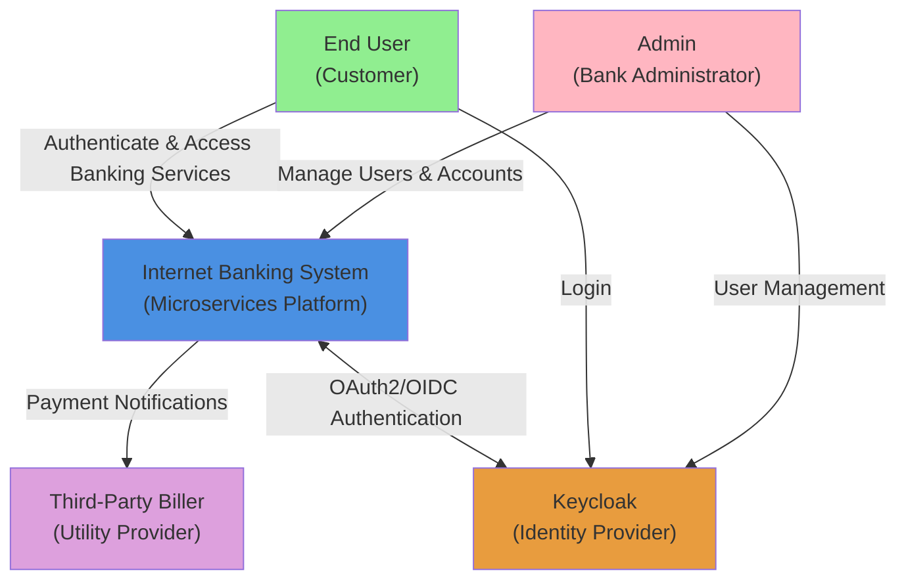
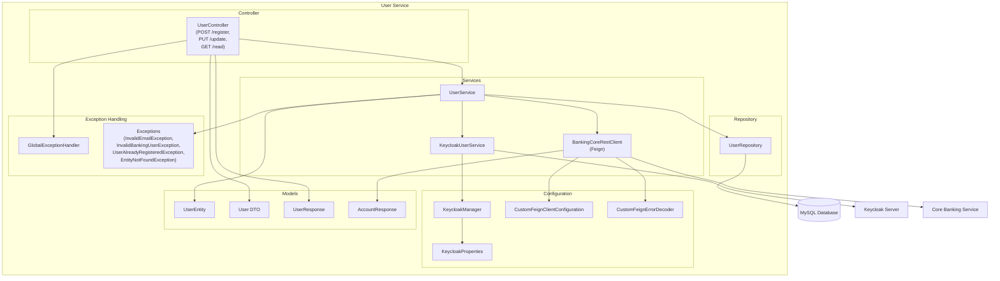
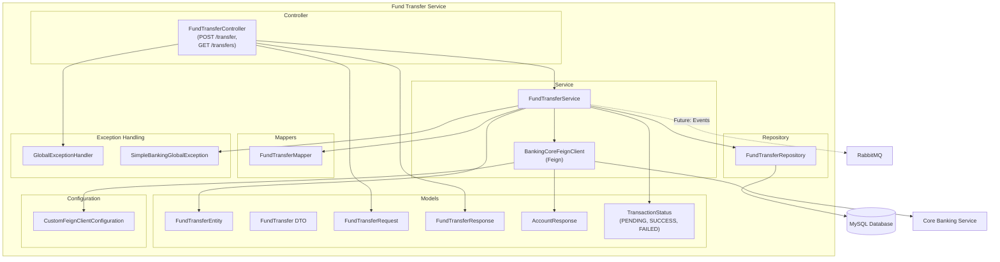
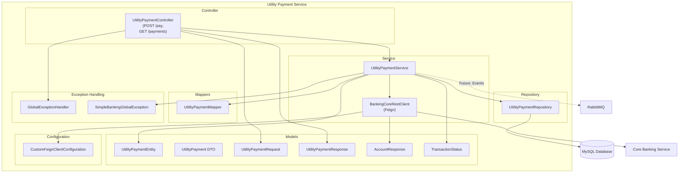
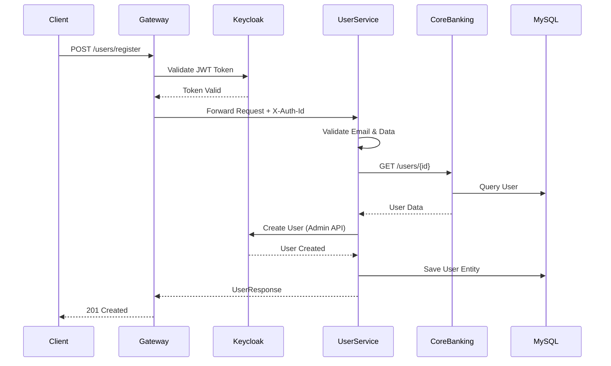
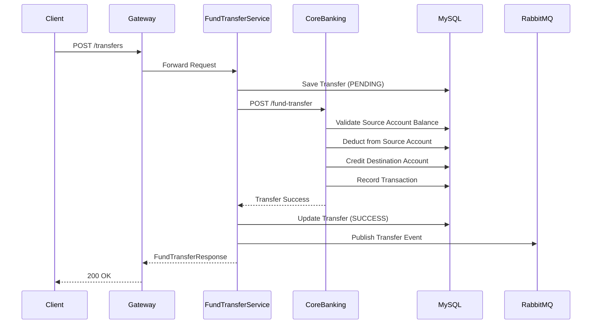
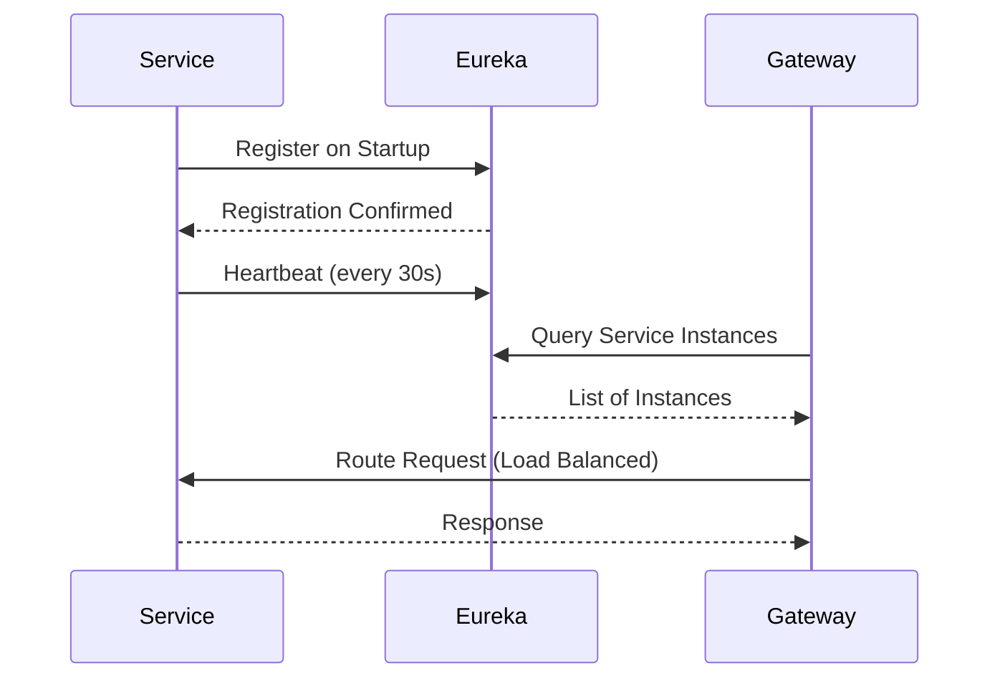

# Product Architecture - Internet Banking Microservices System

## 1. Introduction

This document provides a comprehensive architectural view of the Internet Banking Microservices System using the C4 model (Context, Containers, Components, and Code). The architecture is designed for scalability, maintainability, and security while supporting core banking operations.

## 2. C4 Model - Level 1: System Context

### 2.1 Context Diagram

The following diagram illustrates the system context showing external actors and systems:



### 2.2 External Actors

**End User (Customer)**: Banking customers who interact with the system to perform financial operations including account inquiries, fund transfers, utility payments, and profile management.

**Admin (Bank Administrator)**: Bank staff responsible for user administration, account management, system monitoring, and operational oversight.

**Third-Party Biller (Utility Provider)**: External utility service providers who receive payment notifications and confirmations for services rendered to customers.

**Keycloak (Identity Provider)**: External authentication and authorization server providing OAuth2/OpenID Connect capabilities, user federation, and role-based access control.

## 3. C4 Model - Level 2: Container View

### 3.1 Container Diagram

The following diagram shows the high-level containers (applications and data stores) that make up the system:

```mermaid
graph TB
    subgraph "External Systems"
        EndUser["End User"]
        Admin["Admin"]
        Keycloak["Keycloak Server<br/>(OAuth2/OIDC)"]
        Biller["Utility Provider"]
    end
    
    subgraph "Internet Banking System"
        Gateway["API Gateway<br/>(Spring Cloud Gateway)<br/>Port: 8080"]
        
        subgraph "Business Services"
            UserService["User Service<br/>(Spring Boot)<br/>Port: 8082"]
            CoreService["Core Banking Service<br/>(Spring Boot)<br/>Port: 8083"]
            FundService["Fund Transfer Service<br/>(Spring Boot)<br/>Port: 8084"]
            PaymentService["Utility Payment Service<br/>(Spring Boot)<br/>Port: 8085"]
        end
        
        subgraph "Infrastructure Services"
            Eureka["Service Registry<br/>(Eureka Server)<br/>Port: 8081"]
            ConfigServer["Config Server<br/>(Spring Cloud Config)<br/>Port: 8090"]
        end
        
        subgraph "Data Stores"
            MySQL["MySQL Database<br/>(Relational DB)"]
            GitRepo["Git Repository<br/>(Configuration Store)"]
        end
        
        subgraph "Observability"
            Zipkin["Zipkin Server<br/>(Distributed Tracing)"]
            Prometheus["Prometheus<br/>(Metrics Collection)"]
        end
        
        RabbitMQ["RabbitMQ<br/>(Message Broker)"]
    end
    
    EndUser -->|"HTTPS/REST"| Gateway
    Admin -->|"HTTPS/REST"| Gateway
    
    Gateway -->|"OAuth2 Token Validation"| Keycloak
    Gateway -->|"Service Discovery"| Eureka
    Gateway -->|"Routes Requests"| UserService
    Gateway -->|"Routes Requests"| CoreService
    Gateway -->|"Routes Requests"| FundService
    Gateway -->|"Routes Requests"| PaymentService
    
    UserService -->|"User Management API"| Keycloak
    UserService -->|"Feign Client"| CoreService
    FundService -->|"Feign Client"| CoreService
    PaymentService -->|"Feign Client"| CoreService
    
    UserService -->|"Register"| Eureka
    CoreService -->|"Register"| Eureka
    FundService -->|"Register"| Eureka
    PaymentService -->|"Register"| Eureka
    Gateway -->|"Register"| Eureka
    
    UserService -->|"Fetch Config"| ConfigServer
    CoreService -->|"Fetch Config"| ConfigServer
    FundService -->|"Fetch Config"| ConfigServer
    PaymentService -->|"Fetch Config"| ConfigServer
    Gateway -->|"Fetch Config"| ConfigServer
    
    ConfigServer -->|"Read Configuration"| GitRepo
    
    UserService -->|"JDBC"| MySQL
    CoreService -->|"JDBC"| MySQL
    FundService -->|"JDBC"| MySQL
    PaymentService -->|"JDBC"| MySQL
    
    UserService -->|"Publish Events"| RabbitMQ
    FundService -->|"Publish Events"| RabbitMQ
    PaymentService -->|"Publish Events"| RabbitMQ
    
    UserService -->|"Trace Data"| Zipkin
    CoreService -->|"Trace Data"| Zipkin
    FundService -->|"Trace Data"| Zipkin
    PaymentService -->|"Trace Data"| Zipkin
    Gateway -->|"Trace Data"| Zipkin
    
    UserService -->|"Metrics"| Prometheus
    CoreService -->|"Metrics"| Prometheus
    FundService -->|"Metrics"| Prometheus
    PaymentService -->|"Metrics"| Prometheus
    
    PaymentService -.->|"Payment Notification"| Biller
    
    style Gateway fill:#4A90E2
    style Eureka fill:#E89C3E
    style ConfigServer fill:#E89C3E
```



### 3.2 Container Descriptions

#### 3.2.1 API Gateway (Spring Cloud Gateway)

**Technology**: Spring Cloud Gateway (WebFlux), Spring Security OAuth2, Java 11

**Purpose**: Single entry point for all external client requests providing routing, authentication, and cross-cutting concerns.

**Key Responsibilities**:
- Route requests to appropriate microservices based on path patterns
- Validate OAuth2 JWT tokens from Keycloak
- Extract user identity and propagate via X-Auth-Id header
- Implement CORS policies for browser-based clients
- Provide load balancing across service instances
- Apply rate limiting (future enhancement)

**Communication**:
- Inbound: HTTPS REST from external clients
- Outbound: HTTP to downstream microservices discovered via Eureka
- Integration: OAuth2 token validation with Keycloak

#### 3.2.2 Service Registry (Netflix Eureka)

**Technology**: Netflix Eureka Server, Spring Boot, Java 11

**Purpose**: Service discovery and registry for dynamic service location and health monitoring.

**Key Responsibilities**:
- Maintain registry of all service instances with health status
- Provide service discovery endpoints for clients
- Monitor heartbeats and automatically deregister unhealthy instances
- Support horizontal scaling with dynamic instance registration
- Enable client-side load balancing

**Port**: 8081

**High Availability**: Supports peer-aware mode for production with multiple Eureka instances.

#### 3.2.3 Config Server (Spring Cloud Config)

**Technology**: Spring Cloud Config Server, Spring Boot, Java 11

**Purpose**: Centralized configuration management for all microservices.

**Key Responsibilities**:
- Serve externalized configuration from Git repository
- Support environment-specific configuration profiles (dev, test, prod)
- Provide configuration versioning and rollback capabilities
- Enable configuration refresh without service restart (via Spring Cloud Bus)
- Encrypt sensitive properties

**Port**: 8090

**Backend**: Git repository at https://github.com/javatodev/internet-banking-configurations.git

#### 3.2.4 User Service

**Technology**: Spring Boot, Spring Data JPA, Keycloak Admin Client, OpenFeign, Java 11

**Purpose**: Manage user registration, profile updates, and user lifecycle integrated with Keycloak.

**Key Responsibilities**:
- Register new users with validation
- Create users in Keycloak via Admin API
- Synchronize user data between local DB and Keycloak
- Update user profiles
- Query user details from Core Banking service
- Handle user-related exceptions and validations

**Database Schema**: User entities (identification_number, email, first_name, last_name)

**External Dependencies**: Keycloak, Core Banking Service

#### 3.2.5 Core Banking Service

**Technology**: Spring Boot, Spring Data JPA, Flyway, MySQL, Java 11

**Purpose**: Central service managing accounts, transactions, and core banking operations.

**Key Responsibilities**:
- Manage bank accounts (SAVINGS, CURRENT) with status tracking
- Track account balances (actual and available)
- Process fund transfer requests with balance validation
- Process utility payment requests
- Record all transactions with full audit trail
- Manage utility account providers
- Provide user and account query APIs

**Database Schema**: 
- banking_core_user
- banking_core_account (with foreign key to user)
- banking_core_transaction (with foreign key to account)
- banking_core_utility_account

**Flyway Migrations**: Versioned schema migrations in db/migration folder

#### 3.2.6 Fund Transfer Service

**Technology**: Spring Boot, Spring Data JPA, OpenFeign, MySQL, Java 11

**Purpose**: Orchestrate fund transfers between accounts and maintain transfer history.

**Key Responsibilities**:
- Accept and validate fund transfer requests
- Invoke Core Banking service to execute transfers
- Track transfer status (PENDING, SUCCESS, FAILED)
- Maintain fund transfer transaction records
- Provide transfer history with pagination
- Publish transfer events to RabbitMQ

**Database Schema**: Fund transfer entities with status tracking

**External Dependencies**: Core Banking Service (via Feign client)

#### 3.2.7 Utility Payment Service

**Technology**: Spring Boot, Spring Data JPA, OpenFeign, MySQL, Java 11

**Purpose**: Process utility bill payments and coordinate with Core Banking for fund deduction.

**Key Responsibilities**:
- Accept and validate utility payment requests
- Invoke Core Banking service to process payments
- Track payment status and outcomes
- Maintain payment transaction history
- Validate utility provider accounts
- Publish payment events to RabbitMQ

**Database Schema**: Utility payment entities with provider information

**External Dependencies**: Core Banking Service (via Feign client), Utility Providers (future)

#### 3.2.8 MySQL Database

**Technology**: MySQL 8.x, JDBC

**Purpose**: Persistent data storage for all microservices.

**Schema Organization**: Each service manages its own schema within shared MySQL instance following database-per-service pattern logically.

**Tables**:
- User tables: banking_core_user
- Account tables: banking_core_account, banking_core_utility_account
- Transaction tables: banking_core_transaction, fund transfer records, payment records

**Migration**: Flyway manages schema versioning for Core Banking service

**Testing**: H2 in-memory database used for integration tests

#### 3.2.9 RabbitMQ Message Broker

**Technology**: RabbitMQ (AMQP)

**Purpose**: Asynchronous message broker for event-driven communication.

**Use Cases**:
- Transaction notification events
- Cross-service event propagation
- Audit event publishing
- Future notification service integration

**Message Patterns**: Topic exchanges for event routing

#### 3.2.10 Zipkin Server

**Technology**: Zipkin

**Purpose**: Distributed tracing system for monitoring and troubleshooting microservices.

**Integration**: Spring Cloud Sleuth automatically instruments services and sends trace data to Zipkin.

**Capabilities**:
- Visualize request flows across services
- Identify performance bottlenecks
- Analyze latency distributions
- Track error rates per service

#### 3.2.11 Prometheus

**Technology**: Prometheus

**Purpose**: Metrics collection and monitoring for system health and performance.

**Integration**: Spring Boot Actuator exposes metrics endpoints consumed by Prometheus.

**Metrics Collected**:
- JVM metrics (heap, threads, GC)
- HTTP request metrics (rate, duration, errors)
- Database connection pool metrics
- Custom business metrics

#### 3.2.12 Keycloak

**Technology**: Keycloak (external system)

**Purpose**: Identity and Access Management (IAM) providing OAuth2/OIDC authentication.

**Integration Points**:
- API Gateway validates JWT tokens
- User Service uses Admin API for user management
- Users authenticate via Keycloak login pages

**Configuration**: Requires realm, clients, and roles pre-configured

## 4. Component View - Core Banking Service

### 4.1 Component Diagram

```mermaid
graph TB
    subgraph "Core Banking Service"
        subgraph "Controllers"
            AccountController["AccountController"]
            TransactionController["TransactionController"]
            UserController["UserController"]
        end
        
        subgraph "Services"
            AccountService["AccountService"]
            TransactionService["TransactionService"]
            UserService["UserService"]
        end
        
        subgraph "Repositories"
            BankAccountRepository["BankAccountRepository"]
            TransactionRepository["TransactionRepository"]
            UserRepository["UserRepository"]
            UtilityAccountRepository["UtilityAccountRepository"]
        end
        
        subgraph "Models"
            Entities["Entities<br/>(BankAccountEntity,<br/>TransactionEntity,<br/>UserEntity,<br/>UtilityAccountEntity)"]
            DTOs["DTOs<br/>(BankAccount,<br/>Transaction,<br/>User,<br/>UtilityAccount)"]
            Requests["Requests<br/>(FundTransferRequest,<br/>UtilityPaymentRequest)"]
            Responses["Responses<br/>(FundTransferResponse,<br/>UtilityPaymentResponse)"]
        end
        
        subgraph "Exception Handling"
            GlobalExceptionHandler["GlobalExceptionHandler"]
            Exceptions["Custom Exceptions<br/>(EntityNotFoundException,<br/>InsufficientFundsException,<br/>SimpleBankingGlobalException)"]
        end
        
        subgraph "Mappers"
            Mappers["Mappers<br/>(BankAccountMapper,<br/>UserMapper,<br/>UtilityAccountMapper)"]
        end
        
        AccountController --> AccountService
        TransactionController --> TransactionService
        UserController --> UserService
        
        AccountService --> BankAccountRepository
        AccountService --> UtilityAccountRepository
        TransactionService --> BankAccountRepository
        TransactionService --> TransactionRepository
        TransactionService --> AccountService
        UserService --> UserRepository
        
        AccountService --> Mappers
        TransactionService --> Mappers
        UserService --> Mappers
        
        Controllers --> DTOs
        Controllers --> Requests
        Controllers --> Responses
        Services --> DTOs
        Services --> Entities
        Repositories --> Entities
        
        Controllers --> GlobalExceptionHandler
        Services --> Exceptions
    end
    
    MySQL[(MySQL Database)]
    Repositories --> MySQL
```

### 4.2 Component Descriptions

**Controllers**: REST endpoints exposing banking APIs for accounts, transactions, and users.

**Services**: Business logic layer handling account management, transaction processing, and user operations with validation.

**Repositories**: Spring Data JPA repositories providing database access abstraction.

**Models**: Domain entities (JPA), DTOs for API contracts, request/response objects.

**Exception Handling**: Global exception handler with custom exception hierarchy.

**Mappers**: Entity-DTO conversion utilities.

**Flyway Migrations**: Database schema versioning (V1.0.x SQL scripts).

## 5. Component View - User Service

### 5.1 Component Diagram



### 5.2 Component Descriptions

**UserController**: REST API endpoints for user registration, updates, and queries.

**UserService**: Business logic for user lifecycle management, validation, and coordination.

**KeycloakUserService**: Integration layer for Keycloak Admin API operations.

**BankingCoreRestClient**: Feign client for inter-service communication with Core Banking.

**Keycloak Configuration**: Manages Keycloak client instances and properties.

**Feign Configuration**: Custom error decoder and client configuration for resilience.

**Exception Handling**: Domain-specific exceptions with global handler.

## 6. Component View - Fund Transfer Service

### 6.1 Component Diagram



### 6.2 Component Descriptions

**FundTransferController**: REST endpoints for initiating transfers and querying history.

**FundTransferService**: Orchestrates transfer lifecycle, status tracking, and persistence.

**BankingCoreFeignClient**: Feign client for invoking Core Banking transfer API.

**FundTransferRepository**: Database access for fund transfer records.

**Models**: Transfer entities, DTOs, and status enums.

**Feign Configuration**: Custom Feign client settings for logging and error handling.

## 7. Component View - Utility Payment Service

### 7.1 Component Diagram



### 7.2 Component Descriptions

**UtilityPaymentController**: REST endpoints for payment initiation and history.

**UtilityPaymentService**: Orchestrates payment processing, validation, and tracking.

**BankingCoreRestClient**: Feign client for Core Banking payment API invocation.

**UtilityPaymentRepository**: Database persistence for payment records.

**Models**: Payment entities, DTOs, requests, and responses.

## 8. Component View - API Gateway

### 8.1 Component Diagram

```mermaid
graph TB
    subgraph "API Gateway"
        subgraph "Main Application"
            GatewayApp["InternetBankingApiGatewayApplication<br/>(@EnableEurekaClient)"]
        end
        
        subgraph "Configuration"
            GatewayConfiguration["GatewayConfiguration<br/>(Global Filter)"]
            SecurityConfiguration["SecurityConfiguration<br/>(OAuth2 Resource Server)"]
            RouteConfiguration["application.yml<br/>(Route Definitions)"]
        end
        
        subgraph "Filters"
            AuthFilter["Authentication Filter<br/>(Extract JWT Username)"]
            HeaderFilter["Header Propagation Filter<br/>(X-Auth-Id)"]
        end
        
        subgraph "Security"
            OAuth2ResourceServer["OAuth2 Resource Server<br/>(JWT Validation)"]
            JwtDecoder["JWT Decoder"]
        end
        
        GatewayApp --> GatewayConfiguration
        GatewayApp --> SecurityConfiguration
        GatewayApp --> RouteConfiguration
        
        GatewayConfiguration --> AuthFilter
        GatewayConfiguration --> HeaderFilter
        
        SecurityConfiguration --> OAuth2ResourceServer
        OAuth2ResourceServer --> JwtDecoder
    end
    
    Keycloak[Keycloak<br/>(Token Issuer)]
    Eureka[Eureka Server<br/>(Service Discovery)]
    Microservices[Business Microservices]
    
    JwtDecoder --> Keycloak
    GatewayApp --> Eureka
    RouteConfiguration --> Microservices
    HeaderFilter --> Microservices
```

### 8.2 Component Descriptions

**GatewayConfiguration**: Defines global filters for authentication and header propagation.

**SecurityConfiguration**: Configures OAuth2 resource server with JWT validation.

**Route Configuration**: Defines routing rules to downstream services via YAML.

**Authentication Filter**: Extracts username from JWT tokens.

**Header Propagation Filter**: Adds X-Auth-Id header with user identity for downstream services.

**OAuth2 Resource Server**: Validates JWT tokens against Keycloak public keys.

## 9. Component View - Config Server

### 9.1 Component Diagram

```mermaid
graph TB
    subgraph "Config Server"
        ConfigApp["InternetBankingConfigServerApplication<br/>(@EnableConfigServer)"]
        
        GitBackend["Git Backend<br/>(Configuration Repository)"]
        
        ConfigEndpoints["Config Endpoints<br/>/{application}/{profile}"]
        
        EncryptionSupport["Encryption Support<br/>(RSA/Symmetric)"]
    end
    
    GitRepo[Git Repository<br/>github.com/javatodev]
    Microservices[Microservices<br/>(Config Clients)]
    
    ConfigApp --> GitBackend
    GitBackend --> GitRepo
    ConfigApp --> ConfigEndpoints
    ConfigApp --> EncryptionSupport
    ConfigEndpoints --> Microservices
```

### 9.2 Component Descriptions

**Git Backend**: Reads configuration from Git repository with search paths.

**Config Endpoints**: Serves configuration to clients based on application name and profile.

**Encryption Support**: Encrypts/decrypts sensitive configuration properties.

## 10. Data Flow Patterns

### 10.1 User Registration Flow



### 10.2 Fund Transfer Flow



### 10.3 Service Discovery Flow



## 11. Technology Stack Summary

| Component | Technology | Version |
|-----------|-----------|---------|
| Programming Language | Java | 11 |
| Framework | Spring Boot | 2.5.0 |
| API Gateway | Spring Cloud Gateway | 2020.0.4 |
| Service Discovery | Netflix Eureka | 2020.0.4 |
| Configuration | Spring Cloud Config | 2020.0.4 |
| HTTP Client | Spring Cloud OpenFeign | 2020.0.4 |
| Database | MySQL | 8.x |
| Migration Tool | Flyway | 8.0.3 |
| Test Database | H2 | 1.4.200 |
| Message Broker | RabbitMQ | (external) |
| Identity Provider | Keycloak | (external) |
| Distributed Tracing | Zipkin + Sleuth | 2020.0.4 |
| Metrics | Prometheus | (external) |
| Build Tool | Gradle | 7.x |
| Container Runtime | Docker | (deployment) |
| Orchestration | Kubernetes | (deployment) |

## 12. Cross-Cutting Concerns

### 12.1 Distributed Tracing

Spring Cloud Sleuth automatically adds trace and span IDs to logs and HTTP headers. All services propagate correlation IDs, and trace data is sent to Zipkin for visualization.

### 12.2 Metrics and Monitoring

Spring Boot Actuator exposes metrics endpoints. Prometheus scrapes these endpoints for time-series data. Grafana dashboards (external setup) visualize metrics.

### 12.3 Logging

Each service logs to stdout. Correlation IDs from Sleuth enable tracing requests across services. Centralized logging (ELK stack) is recommended for production.

### 12.4 Security

Multi-layer security approach:
- Authentication at API Gateway via OAuth2 JWT validation
- Authorization rules at gateway level
- User identity propagation via X-Auth-Id header
- Service-to-service calls inherit user context
- Role-based access control managed in Keycloak

### 12.5 Configuration Management

Environment-specific configuration stored in Git repository. Services fetch configuration from Config Server on startup. Sensitive properties can be encrypted.

### 12.6 Health Checks

All services expose `/actuator/health` endpoints. Eureka uses these for service health monitoring. Kubernetes readiness and liveness probes consume these endpoints.
