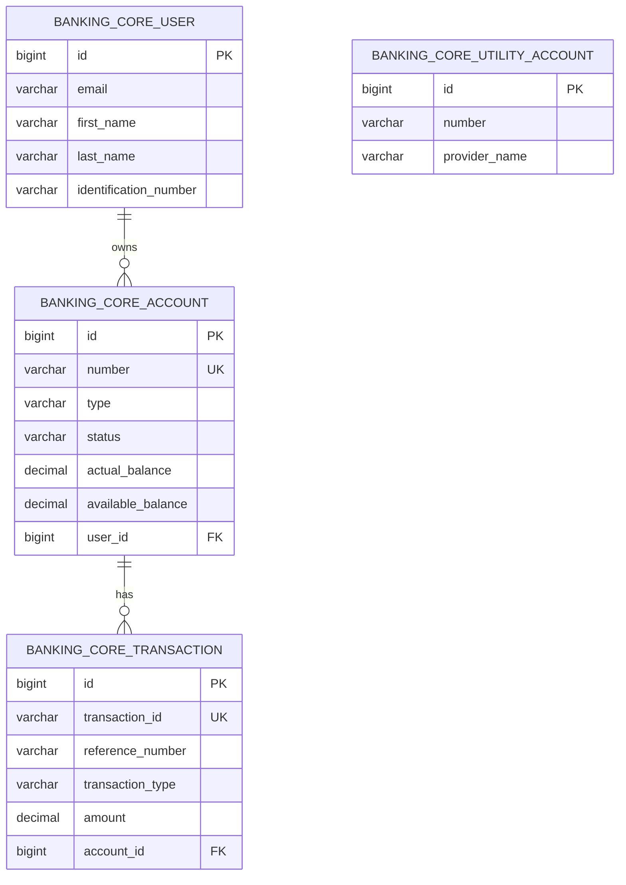
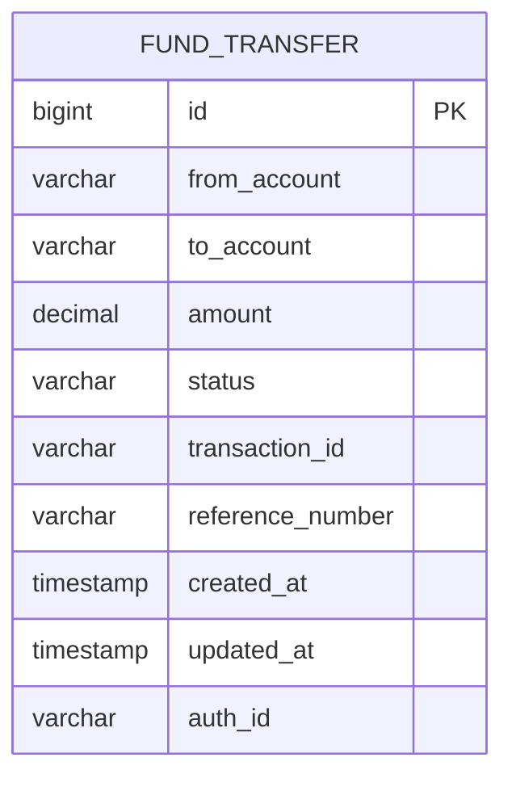
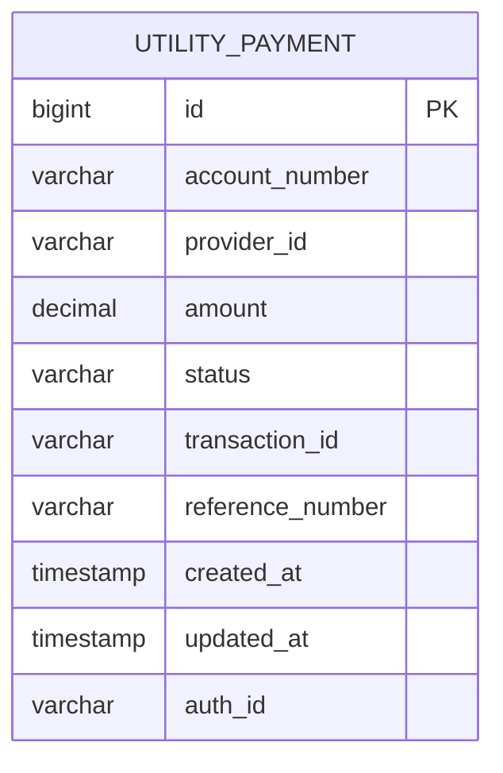
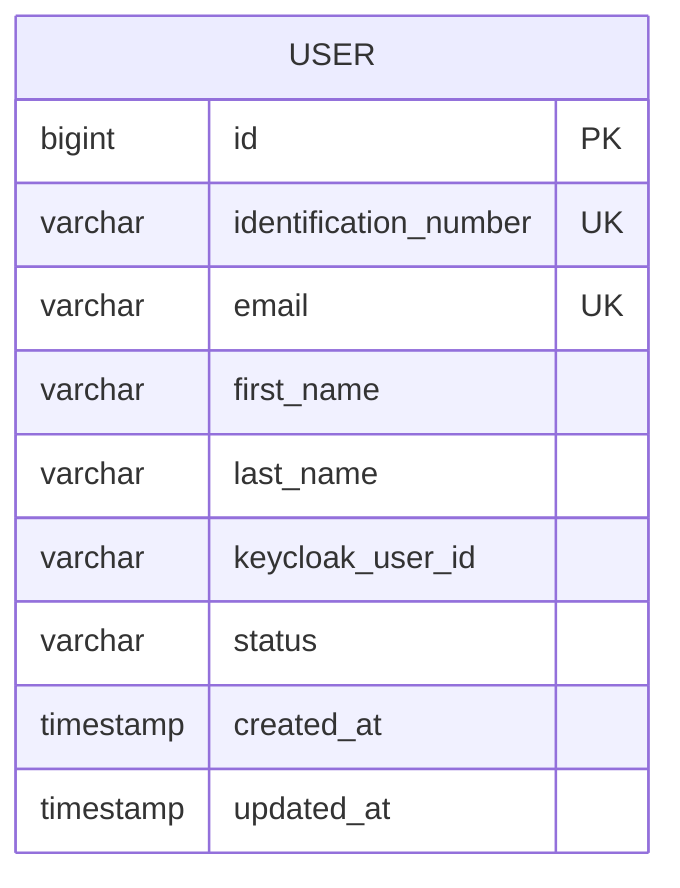

# Data Architecture - Internet Banking Microservices System

## 1. Overview

This document describes the data architecture for the Internet Banking Microservices System, covering database design, entity relationships, migration strategy, data ownership patterns, and data management practices. The system uses MySQL as the primary relational database with Flyway for schema versioning and H2 for testing.

## 2. Database Architecture Pattern

### 2.1 Database Per Service Pattern

The system implements a logical database-per-service pattern where each microservice owns its data and schema. While services may share the same MySQL database server, they maintain separate schemas or table namespaces to enforce bounded contexts and loose coupling.

**Service Data Ownership**:

- **Core Banking Service**: Owns accounts, transactions, users, and utility accounts
- **User Service**: Owns user profile data (synchronized with Core Banking)
- **Fund Transfer Service**: Owns fund transfer transaction records
- **Utility Payment Service**: Owns utility payment transaction records

### 2.2 Data Access Patterns

**Direct Database Access**: Each service accesses only its own database schema via JDBC through Spring Data JPA repositories.

**Cross-Service Data Access**: Services query other services via REST APIs (OpenFeign clients) rather than direct database access, maintaining service boundaries.

## 3. Entity-Relationship Overview

### 3.1 Core Banking Schema - ER Diagram



### 3.2 Fund Transfer Schema - ER Diagram



### 3.3 Utility Payment Schema - ER Diagram



### 3.4 User Service Schema - ER Diagram



## 4. Detailed Schema Definitions

### 4.1 Core Banking Service Tables

#### 4.1.1 banking_core_user

Stores core user information for banking customers.

| Column Name | Data Type | Constraints | Description |
|------------|-----------|-------------|-------------|
| id | bigint(20) | PRIMARY KEY, AUTO_INCREMENT | Unique user identifier |
| identification_number | varchar(255) | UNIQUE | Government-issued ID number |
| email | varchar(255) | UNIQUE | User email address |
| first_name | varchar(255) | | User first name |
| last_name | varchar(255) | | User last name |

**Indexes**:
- Primary key on `id`
- Unique index on `identification_number`
- Unique index on `email` (application-level)

**Relationships**: One-to-many with banking_core_account

#### 4.1.2 banking_core_account

Stores bank account information including balances and status.

| Column Name | Data Type | Constraints | Description |
|------------|-----------|-------------|-------------|
| id | bigint(20) | PRIMARY KEY, AUTO_INCREMENT | Unique account identifier |
| number | varchar(255) | UNIQUE | Account number |
| type | varchar(255) | | Account type (SAVINGS, CURRENT) |
| status | varchar(255) | | Account status (ACTIVE, INACTIVE, CLOSED) |
| actual_balance | decimal(19,2) | | Current account balance |
| available_balance | decimal(19,2) | | Available balance for transactions |
| user_id | bigint(20) | FOREIGN KEY | Reference to banking_core_user |

**Indexes**:
- Primary key on `id`
- Unique index on `number`
- Foreign key index on `user_id`

**Constraints**:
- `actual_balance` and `available_balance` should be non-negative (application-level validation)
- Foreign key constraint: `user_id` references `banking_core_user(id)`

**Relationships**:
- Many-to-one with banking_core_user
- One-to-many with banking_core_transaction

#### 4.1.3 banking_core_transaction

Records all financial transactions for audit and history.

| Column Name | Data Type | Constraints | Description |
|------------|-----------|-------------|-------------|
| id | bigint(20) | PRIMARY KEY, AUTO_INCREMENT | Unique transaction identifier |
| transaction_id | varchar(50) | UNIQUE, NOT NULL | Business transaction identifier |
| reference_number | varchar(50) | NOT NULL | External reference number |
| transaction_type | varchar(30) | NOT NULL | Type (FUND_TRANSFER, UTILITY_PAYMENT) |
| amount | decimal(19,2) | | Transaction amount |
| account_id | bigint(20) | FOREIGN KEY | Reference to banking_core_account |

**Indexes**:
- Primary key on `id`
- Unique index on `transaction_id`
- Index on `reference_number`
- Foreign key index on `account_id`

**Constraints**:
- `amount` must be positive (application-level validation)
- Foreign key constraint: `account_id` references `banking_core_account(id)`

**Relationships**: Many-to-one with banking_core_account

#### 4.1.4 banking_core_utility_account

Stores utility provider account information.

| Column Name | Data Type | Constraints | Description |
|------------|-----------|-------------|-------------|
| id | bigint(20) | PRIMARY KEY, AUTO_INCREMENT | Unique utility account identifier |
| number | varchar(255) | | Utility account number |
| provider_name | varchar(255) | | Utility provider name |

**Indexes**: Primary key on `id`

### 4.2 Fund Transfer Service Tables

#### 4.2.1 fund_transfer (Assumed Schema)

Stores fund transfer transaction records maintained by Fund Transfer Service.

| Column Name | Data Type | Constraints | Description |
|------------|-----------|-------------|-------------|
| id | bigint(20) | PRIMARY KEY, AUTO_INCREMENT | Unique transfer identifier |
| from_account | varchar(255) | NOT NULL | Source account number |
| to_account | varchar(255) | NOT NULL | Destination account number |
| amount | decimal(19,2) | NOT NULL | Transfer amount |
| status | varchar(50) | NOT NULL | Status (PENDING, SUCCESS, FAILED) |
| transaction_id | varchar(100) | UNIQUE | Correlation transaction ID |
| reference_number | varchar(100) | | Reference number |
| auth_id | varchar(255) | | User who initiated transfer |
| created_at | timestamp | DEFAULT CURRENT_TIMESTAMP | Creation timestamp |
| updated_at | timestamp | ON UPDATE CURRENT_TIMESTAMP | Last update timestamp |

**Indexes**:
- Primary key on `id`
- Index on `transaction_id`
- Index on `from_account`
- Index on `status`

### 4.3 Utility Payment Service Tables

#### 4.3.1 utility_payment (Assumed Schema)

Stores utility payment transaction records maintained by Utility Payment Service.

| Column Name | Data Type | Constraints | Description |
|------------|-----------|-------------|-------------|
| id | bigint(20) | PRIMARY KEY, AUTO_INCREMENT | Unique payment identifier |
| account_number | varchar(255) | NOT NULL | Paying account number |
| provider_id | varchar(255) | NOT NULL | Utility provider identifier |
| utility_account_number | varchar(255) | | Utility account number |
| amount | decimal(19,2) | NOT NULL | Payment amount |
| status | varchar(50) | NOT NULL | Status (PENDING, SUCCESS, FAILED) |
| transaction_id | varchar(100) | UNIQUE | Correlation transaction ID |
| reference_number | varchar(100) | | Reference number |
| auth_id | varchar(255) | | User who initiated payment |
| created_at | timestamp | DEFAULT CURRENT_TIMESTAMP | Creation timestamp |
| updated_at | timestamp | ON UPDATE CURRENT_TIMESTAMP | Last update timestamp |

**Indexes**:
- Primary key on `id`
- Index on `transaction_id`
- Index on `account_number`
- Index on `status`

### 4.4 User Service Tables

#### 4.4.1 user (Assumed Schema)

Stores user profile information managed by User Service with Keycloak synchronization.

| Column Name | Data Type | Constraints | Description |
|------------|-----------|-------------|-------------|
| id | bigint(20) | PRIMARY KEY, AUTO_INCREMENT | Unique user identifier |
| identification_number | varchar(255) | UNIQUE, NOT NULL | Government ID number |
| email | varchar(255) | UNIQUE, NOT NULL | User email |
| first_name | varchar(255) | NOT NULL | First name |
| last_name | varchar(255) | NOT NULL | Last name |
| keycloak_user_id | varchar(255) | UNIQUE | Keycloak user UUID |
| status | varchar(50) | | User status (ACTIVE, INACTIVE) |
| created_at | timestamp | DEFAULT CURRENT_TIMESTAMP | Creation timestamp |
| updated_at | timestamp | ON UPDATE CURRENT_TIMESTAMP | Last update timestamp |

**Indexes**:
- Primary key on `id`
- Unique index on `identification_number`
- Unique index on `email`
- Unique index on `keycloak_user_id`

## 5. Flyway Migration Strategy

### 5.1 Migration Overview

Flyway is used for versioned schema migrations ensuring consistent database evolution across environments. Migrations are applied automatically on application startup.

**Location**: `/src/main/resources/db/migration/`

**Naming Convention**: `V{version}__{description}.sql`

Example: `V1.0.20210427174638__create_base_table_structure.sql`

### 5.2 Existing Migrations (Core Banking Service)

#### V1.0.20210427174638__create_base_table_structure.sql

Creates initial schema for users, accounts, and utility accounts.

**DDL Summary**:
```sql
CREATE TABLE banking_core_user (
    id BIGINT PRIMARY KEY AUTO_INCREMENT,
    email VARCHAR(255),
    first_name VARCHAR(255),
    identification_number VARCHAR(255),
    last_name VARCHAR(255)
);

CREATE TABLE banking_core_account (
    id BIGINT PRIMARY KEY AUTO_INCREMENT,
    actual_balance DECIMAL(19,2),
    available_balance DECIMAL(19,2),
    number VARCHAR(255),
    status VARCHAR(255),
    type VARCHAR(255),
    user_id BIGINT,
    FOREIGN KEY (user_id) REFERENCES banking_core_user(id)
);

CREATE TABLE banking_core_utility_account (
    id BIGINT PRIMARY KEY AUTO_INCREMENT,
    number VARCHAR(255),
    provider_name VARCHAR(255)
);
```

#### V1.0.20210429210839__create_transaction_table.sql

Adds transaction table for recording financial transactions.

**DDL Summary**:
```sql
CREATE TABLE banking_core_transaction (
    id BIGINT PRIMARY KEY AUTO_INCREMENT,
    amount DECIMAL(19,2),
    transaction_type VARCHAR(30) NOT NULL,
    reference_number VARCHAR(50) NOT NULL,
    transaction_id VARCHAR(50) NOT NULL,
    account_id BIGINT,
    FOREIGN KEY (account_id) REFERENCES banking_core_account(id)
);
```

### 5.3 Migration Best Practices

**Versioning**: Use timestamp-based versions for sequential ordering.

**Idempotency**: Migrations are executed once; Flyway tracks applied migrations in `flyway_schema_history` table.

**Rollback Strategy**: Flyway does not support automatic rollbacks. For critical changes, create compensating migrations or use backup/restore procedures.

**Testing**: Test migrations in lower environments before production deployment.

**Backward Compatibility**: Ensure schema changes are backward compatible with running application versions during rolling deployments.

## 6. Data Consistency and Integrity

### 6.1 Transactional Boundaries

**Single Service Transactions**: Operations within a service use ACID transactions managed by Spring's `@Transactional` annotation.

**Cross-Service Consistency**: Fund transfers and payments span multiple services. The system uses a request-response pattern where the Core Banking service ensures atomicity of balance updates and transaction recording.

**Eventual Consistency**: For non-critical operations (e.g., notification events), the system accepts eventual consistency through asynchronous messaging via RabbitMQ.

### 6.2 Optimistic Locking

Although not explicitly visible in the current entity definitions, JPA supports optimistic locking via `@Version` annotation. This can be added to prevent lost updates in concurrent scenarios.

**Recommendation**: Add version fields to account entities for concurrent balance update protection.

### 6.3 Referential Integrity

Foreign key constraints enforce referential integrity:
- Accounts are linked to users via `user_id` foreign key
- Transactions are linked to accounts via `account_id` foreign key

**Cascade Behavior**: Currently configured with default cascade (no cascade delete). Deleting a user or account requires explicit handling of related entities.

## 7. Testing Strategy with H2

### 7.1 H2 In-Memory Database

H2 is used for integration testing to avoid dependency on external MySQL instances during CI/CD pipelines.

**Configuration**: Defined in `src/test/resources/application.yml`

**Compatibility**: H2 runs in MySQL compatibility mode to support MySQL-specific syntax.

**Flyway Integration**: The same Flyway migrations are applied to H2 during tests, ensuring schema parity.

### 7.2 Test Data Management

**Initial Data**: `V1.0.20210427174721__temp_data.sql` migration inserts test data for development and testing.

**Test Isolation**: Each test class can use `@Transactional` with rollback to maintain test isolation.

**Test Fixtures**: Use Spring Boot's `@Sql` annotation to load test-specific data scripts.

## 8. Data Security

### 8.1 Sensitive Data Protection

**Passwords**: Not stored in application database; managed by Keycloak.

**PII (Personally Identifiable Information)**: User names, emails, and identification numbers are stored. Consider encryption at rest for production.

**Financial Data**: Account balances and transaction amounts stored in plain text. Consider column-level encryption for highly sensitive deployments.

### 8.2 Access Control

**Database Users**: Each service should use a dedicated database user with minimal privileges (CRUD on owned tables only).

**Connection Security**: Use SSL/TLS for database connections in production.

**Secrets Management**: Database credentials should be externalized and managed via Kubernetes Secrets or external secret managers (e.g., HashiCorp Vault).

## 9. Backup and Recovery

### 9.1 Backup Strategy

**Automated Backups**: MySQL automated backups should be configured with daily full backups and transaction log backups for point-in-time recovery.

**Backup Retention**: Retain backups for at least 30 days to meet compliance requirements.

**Backup Testing**: Regularly test backup restoration procedures in non-production environments.

### 9.2 Disaster Recovery

**RTO (Recovery Time Objective)**: Target 4 hours for production database recovery.

**RPO (Recovery Point Objective)**: Target maximum 1 hour of data loss (requires transaction log backups).

**Replication**: Consider MySQL master-slave replication for high availability and read scaling.

## 10. Performance Considerations

### 10.1 Indexing Strategy

**Current Indexes**:
- Primary keys on all tables (clustered indexes)
- Foreign key indexes for join performance
- Unique indexes on account numbers and transaction IDs

**Recommended Additional Indexes**:
- Index on `banking_core_user.email` for user lookup by email
- Index on `banking_core_transaction.transaction_type` for transaction type queries
- Composite index on `(account_id, transaction_type)` for account transaction history queries
- Index on timestamp fields (`created_at`) for time-based queries

### 10.2 Query Optimization

**Use of JPA Queries**: Spring Data JPA generates queries based on method names. For complex queries, use `@Query` with JPQL or native SQL.

**Pagination**: Implement pagination for list queries (already present in fund transfer history) to limit result set sizes.

**Lazy vs. Eager Loading**: Configure appropriate fetch strategies to avoid N+1 query problems.

**Connection Pooling**: Use HikariCP (default in Spring Boot) with appropriate pool size configuration.

### 10.3 Scaling Considerations

**Read Replicas**: For read-heavy workloads, introduce MySQL read replicas and route read queries to replicas.

**Partitioning**: For large transaction tables, consider partitioning by date (monthly or yearly).

**Archiving**: Implement archival strategy to move old transactions to archive tables or separate storage.

## 11. Data Migration Playbook

### 11.1 Adding New Tables

1. Create a new Flyway migration file with incremented version number
2. Write DDL for table creation with appropriate indexes and constraints
3. Test migration in local environment
4. Deploy to development environment and verify
5. Promote through higher environments (QA, staging, production)

### 11.2 Modifying Existing Tables

**Adding Columns**:
```sql
ALTER TABLE banking_core_user ADD COLUMN phone_number VARCHAR(20);
```

**Modifying Columns** (requires careful handling):
```sql
-- Step 1: Add new column
ALTER TABLE banking_core_account ADD COLUMN balance_v2 DECIMAL(20,4);
-- Step 2: Migrate data
UPDATE banking_core_account SET balance_v2 = actual_balance;
-- Step 3: Drop old column (in subsequent migration after code deployment)
ALTER TABLE banking_core_account DROP COLUMN actual_balance;
```

**Removing Columns**: Use a multi-phase approach with code deployment in between migrations to avoid breaking running instances.

### 11.3 Data Migration

For data transformations, create repeatable migrations (R__ prefix) or write data migration scripts executed outside Flyway.

Example: Migrating transaction types to new enum values.

## 12. Monitoring and Observability

### 12.1 Database Metrics

**Monitor**:
- Connection pool utilization (via Actuator and Prometheus)
- Query execution times (via slow query log)
- Database CPU and memory usage
- Disk I/O and storage utilization
- Replication lag (if using replication)

### 12.2 Alerting

**Alert Conditions**:
- Connection pool exhaustion
- Slow query threshold exceeded (>1s)
- Database disk space >80% utilization
- Replication lag >60 seconds
- Failed transactions spike

## 13. Compliance and Audit

### 13.1 Audit Trail

**Transaction Records**: All financial transactions are permanently recorded in `banking_core_transaction` table with transaction IDs and reference numbers.

**User Actions**: Consider adding audit tables to track user modifications (who changed what and when).

**Retention Policy**: Define and implement data retention policies based on regulatory requirements.

### 13.2 Data Privacy

**GDPR Considerations**:
- Implement user data export functionality
- Implement user data deletion (right to be forgotten) with cascading deletes
- Add consent tracking fields if required

**PCI-DSS**: If storing card data (future enhancement), ensure PCI-DSS compliance with tokenization and encryption.

## 14. Future Enhancements

### 14.1 Event Sourcing

Consider event sourcing for transaction history to maintain complete audit trail of all state changes with temporal queries.

### 14.2 CQRS

Implement Command Query Responsibility Segregation to separate read and write models, optimizing each for its workload.

### 14.3 Distributed Transactions

Implement saga pattern or two-phase commit for distributed transactions across services to ensure stronger consistency.

### 14.4 Data Warehouse

Implement data warehouse with ETL pipelines for business intelligence and analytics, separating analytical workloads from transactional database.
