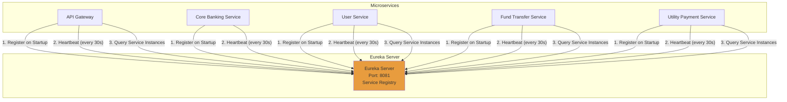
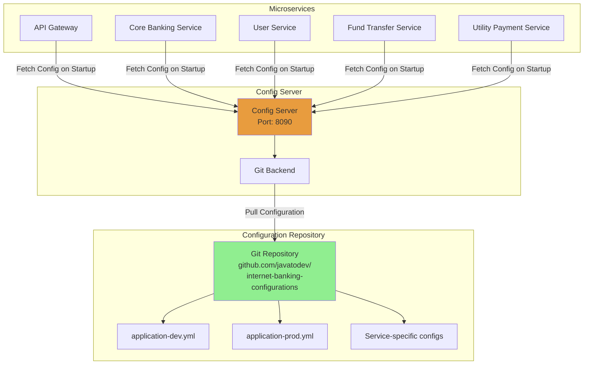
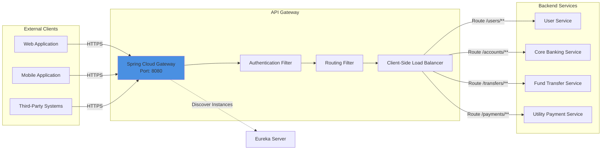
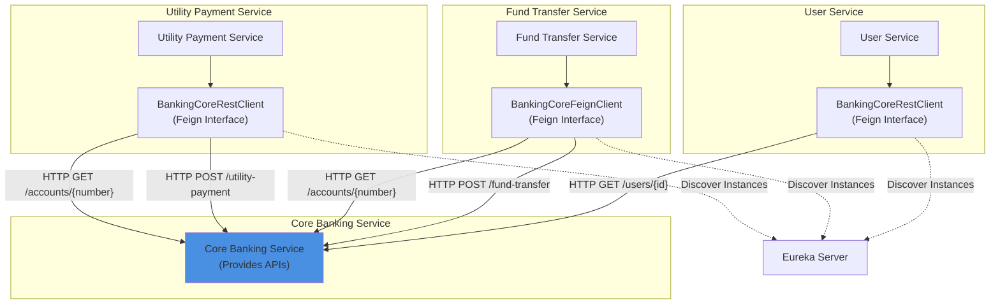
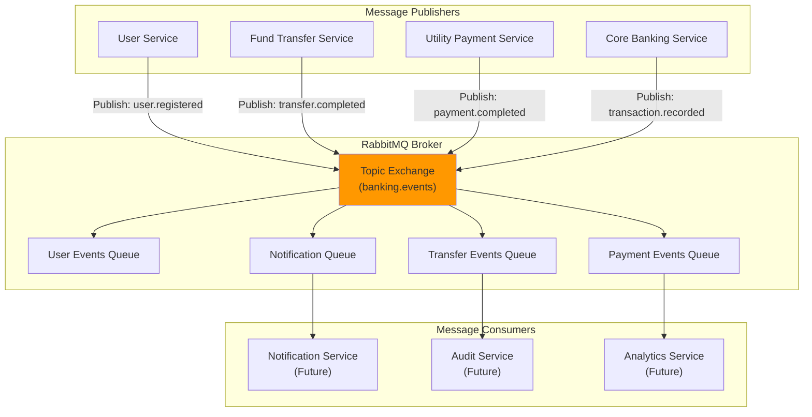
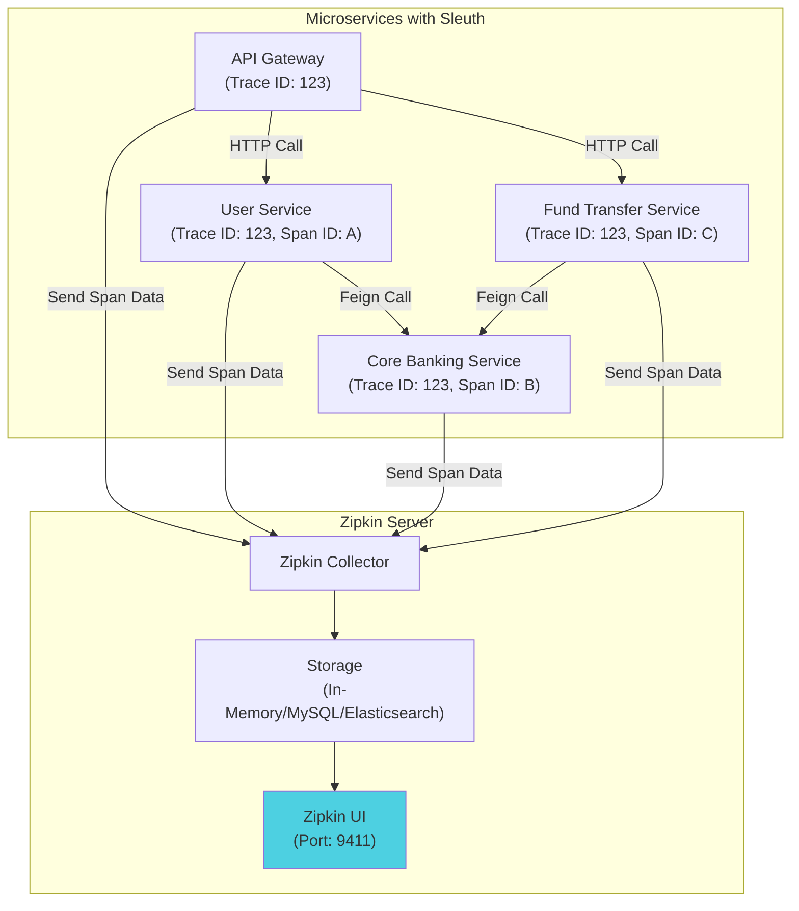
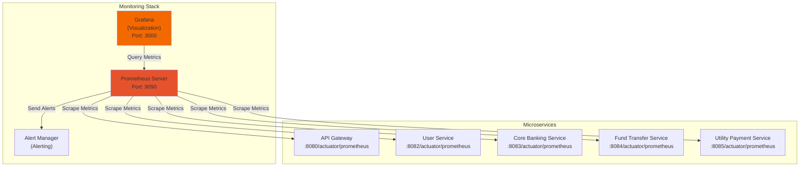
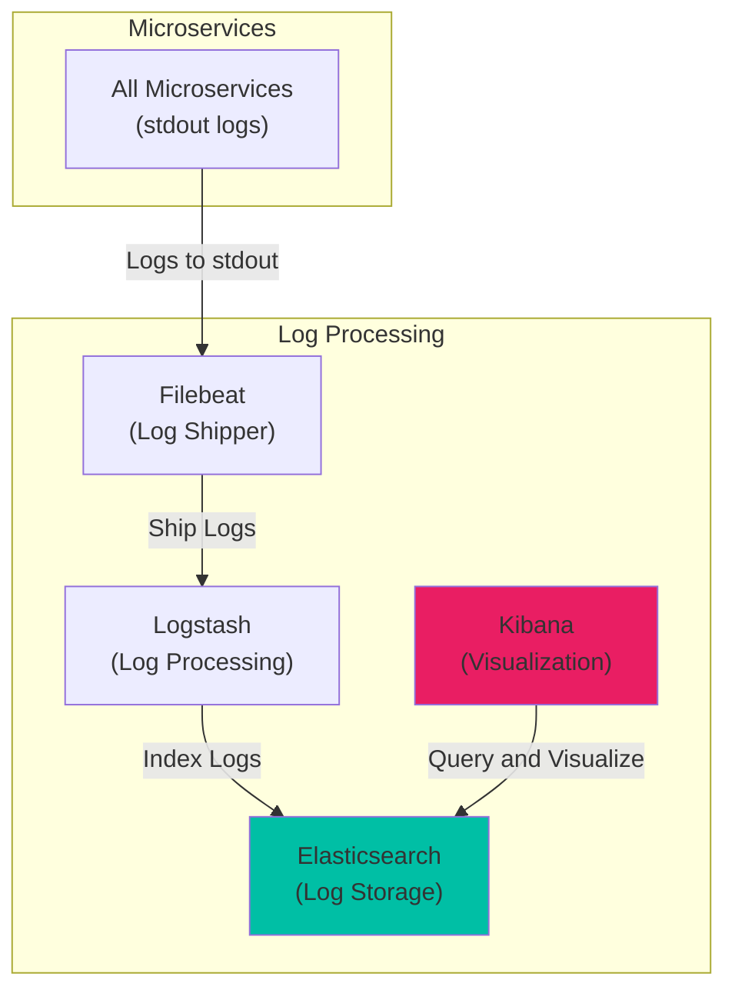

# Integration Architecture - Internet Banking Microservices System

## 1. Overview

This document describes the integration architecture for the Internet Banking Microservices System, detailing how services discover each other, communicate, and coordinate to deliver business functionality. The architecture employs multiple integration patterns including service registry, API gateway, synchronous REST calls, asynchronous messaging, distributed tracing, and centralized configuration.

## 2. Service Discovery with Netflix Eureka

### 2.1 Architecture



### 2.2 Service Registration

All microservices register with Eureka on startup using the `@EnableEurekaClient` annotation.

**Registration Configuration** (application.yml or bootstrap.yml):
```yaml
eureka:
  client:
    service-url:
      defaultZone: http://localhost:8081/eureka
    register-with-eureka: true
    fetch-registry: true
  instance:
    prefer-ip-address: true
    hostname: localhost
    lease-renewal-interval-in-seconds: 30
    lease-expiration-duration-in-seconds: 90
```

**Service Metadata**:
- Application name (spring.application.name)
- Instance ID (hostname:application-name:port)
- Health check URL (/actuator/health)
- Status page URL (/actuator/info)

### 2.3 Service Discovery

**Client-Side Discovery**: Services use Eureka client to discover instances of target services. OpenFeign integrates with Eureka for automatic service resolution.

**Discovery Process**:
1. Client queries Eureka for service instances by application name
2. Eureka returns list of available instances with health status
3. Client applies load balancing algorithm (default: round-robin)
4. Client makes direct HTTP call to selected instance

### 2.4 Health Monitoring

**Heartbeat Mechanism**: Services send heartbeats every 30 seconds to Eureka. If heartbeats stop for 90 seconds (3 missed heartbeats), Eureka marks the instance as DOWN and removes it from the registry.

**Self-Preservation Mode**: Eureka enters self-preservation mode if more than 15% of services fail heartbeats within a short period, preventing mass deregistration during network partitions.

### 2.5 High Availability

**Eureka Clustering**: For production, deploy multiple Eureka servers in peer-aware mode for fault tolerance.

**Configuration for HA**:
```yaml
eureka:
  client:
    service-url:
      defaultZone: http://eureka1:8081/eureka,http://eureka2:8081/eureka
```

## 3. Configuration Management with Spring Cloud Config

### 3.1 Architecture



### 3.2 Configuration Structure

**Repository Organization**:
```
internet-banking-configurations/
└── configuration/
    ├── application.yml                     # Common config
    ├── application-dev.yml                 # Dev environment
    ├── application-prod.yml                # Production environment
    ├── core-banking-service.yml            # Core Banking specific
    ├── core-banking-service-dev.yml
    ├── core-banking-service-prod.yml
    ├── internet-banking-user-service.yml
    ├── internet-banking-fund-transfer-service.yml
    ├── internet-banking-utility-payment-service.yml
    └── internet-banking-api-gateway.yml
```

### 3.3 Config Server Setup

**Config Server Configuration** (application.yml):
```yaml
server:
  port: 8090

spring:
  cloud:
    config:
      server:
        git:
          uri: https://github.com/javatodev/internet-banking-configurations.git
          search-paths: configuration
          default-label: main
```

### 3.4 Config Client Integration

**bootstrap.yml** (loaded before application.yml):
```yaml
spring:
  application:
    name: core-banking-service
  cloud:
    config:
      uri: http://localhost:8090
      fail-fast: true
  profiles:
    active: dev
```

**Configuration Resolution Order**:
1. application.yml (from config server)
2. application-{profile}.yml
3. {service-name}.yml
4. {service-name}-{profile}.yml
5. Local application.yml (if present, lowest priority)

### 3.5 Configuration Refresh

**Manual Refresh**: POST to `/actuator/refresh` endpoint triggers configuration reload for beans annotated with `@RefreshScope`.

**Automatic Refresh** (Future Enhancement): Integrate Spring Cloud Bus with RabbitMQ to broadcast configuration changes to all instances via `/bus/refresh`.

### 3.6 Secrets Management

**Encryption**: Config Server supports symmetric and asymmetric encryption for sensitive properties.

**Example**:
```yaml
spring:
  datasource:
    password: '{cipher}AQA7q3...'  # Encrypted value
```

**Recommendation**: For production, use external secret managers (HashiCorp Vault, AWS Secrets Manager) integrated with Spring Cloud Config.

## 4. API Gateway Routing Patterns

### 4.1 Gateway Architecture



### 4.2 Routing Configuration

**Gateway Routes** (application.yml or dynamic configuration):
```yaml
spring:
  cloud:
    gateway:
      routes:
        - id: user-service
          uri: lb://internet-banking-user-service
          predicates:
            - Path=/api/users/**
          filters:
            - StripPrefix=1

        - id: core-banking-service
          uri: lb://core-banking-service
          predicates:
            - Path=/api/accounts/**,/api/transactions/**
          filters:
            - StripPrefix=1

        - id: fund-transfer-service
          uri: lb://internet-banking-fund-transfer-service
          predicates:
            - Path=/api/transfers/**
          filters:
            - StripPrefix=1

        - id: utility-payment-service
          uri: lb://internet-banking-utility-payment-service
          predicates:
            - Path=/api/payments/**
          filters:
            - StripPrefix=1
```

**URI Scheme**: `lb://` prefix enables client-side load balancing with service discovery via Eureka.

### 4.3 Global Filters

**Authentication Filter** (GatewayConfiguration.java):
- Extracts username from JWT authentication token
- Adds `X-Auth-Id` header to downstream requests
- Enables user context propagation across services

```java
@Bean
public GlobalFilter customGlobalFilter() {
    return ((exchange, chain) -> exchange.getPrincipal().map(principal -> {
        String userName = "";
        if (principal instanceof JwtAuthenticationToken) {
            userName = principal.getName();
        }
        exchange.getRequest().mutate()
                .header("X-Auth-Id", userName)
                .build();
        return exchange;
    }).flatMap(chain::filter));
}
```

### 4.4 Load Balancing

**Client-Side Load Balancing**: Spring Cloud LoadBalancer (replaces Ribbon) distributes requests across multiple instances.

**Algorithm**: Round-robin by default; can be customized with weighted or zone-aware strategies.

### 4.5 Gateway Features

**CORS Configuration**: Enable cross-origin requests for browser-based clients.

**Rate Limiting** (Future): Implement request rate limiting per user or API key using Redis-backed rate limiter.

**Circuit Breaker** (Future): Integrate Resilience4j circuit breaker for fault tolerance.

**Request/Response Transformation**: Modify headers, query parameters, or body content.

## 5. Inter-Service Communication with OpenFeign

### 5.1 Architecture



### 5.2 Feign Client Definition

**Example: BankingCoreFeignClient (Fund Transfer Service)**:
```java
@FeignClient(name = "core-banking-service", configuration = CustomFeignClientConfiguration.class)
public interface BankingCoreFeignClient {
    
    @GetMapping("/accounts/{accountNumber}")
    AccountResponse readAccount(@PathVariable("accountNumber") String accountNumber);
    
    @PostMapping("/fund-transfer")
    FundTransferResponse fundTransfer(@RequestBody FundTransferRequest request);
}
```

**Annotations**:
- `@FeignClient`: Declares Feign client with service name for discovery
- `name`: Service name registered in Eureka
- `configuration`: Custom configuration class for logging, error handling, etc.

### 5.3 Feign Configuration

**Custom Configuration** (CustomFeignClientConfiguration.java):
```java
@Configuration
public class CustomFeignClientConfiguration {
    
    @Bean
    public Logger.Level feignLoggerLevel() {
        return Logger.Level.FULL;  // Log request and response details
    }
    
    @Bean
    public ErrorDecoder errorDecoder() {
        return new CustomFeignErrorDecoder();
    }
}
```

**Logging Levels**:
- `NONE`: No logging
- `BASIC`: Log request method, URL, response status, and execution time
- `HEADERS`: Log request and response headers
- `FULL`: Log request and response headers, body, and metadata

### 5.4 Error Handling

**Custom Error Decoder** (CustomFeignErrorDecoder.java):
```java
public class CustomFeignErrorDecoder implements ErrorDecoder {
    
    @Override
    public Exception decode(String methodKey, Response response) {
        // Parse error response and throw appropriate exception
        if (response.status() == 404) {
            return new EntityNotFoundException("Resource not found");
        }
        if (response.status() == 400) {
            return new SimpleBankingGlobalException("Bad request");
        }
        return new Exception("Generic error");
    }
}
```

### 5.5 Request Interceptors

**Token Propagation**: Add request interceptors to propagate authentication tokens or correlation IDs.

```java
@Bean
public RequestInterceptor requestInterceptor() {
    return requestTemplate -> {
        ServletRequestAttributes attributes = (ServletRequestAttributes) RequestContextHolder.getRequestAttributes();
        if (attributes != null) {
            HttpServletRequest request = attributes.getRequest();
            String authId = request.getHeader("X-Auth-Id");
            if (authId != null) {
                requestTemplate.header("X-Auth-Id", authId);
            }
        }
    };
}
```

### 5.6 Timeout Configuration

**Default Timeouts**: Configure read and connection timeouts to prevent hanging requests.

```yaml
feign:
  client:
    config:
      default:
        connectTimeout: 5000   # 5 seconds
        readTimeout: 10000     # 10 seconds
```

### 5.7 Retry Logic

**Feign Retryer**: Implement custom retryer for transient failures.

```java
@Bean
public Retryer feignRetryer() {
    return new Retryer.Default(100, 1000, 3);  // Max 3 attempts
}
```

## 6. Asynchronous Messaging with RabbitMQ

### 6.1 Architecture



### 6.2 Event Types

**User Events**:
- `user.registered`: Published when new user successfully registers
- `user.updated`: Published when user profile is updated

**Transaction Events**:
- `transfer.initiated`: Fund transfer request received
- `transfer.completed`: Fund transfer successfully processed
- `transfer.failed`: Fund transfer failed
- `payment.initiated`: Utility payment request received
- `payment.completed`: Utility payment successfully processed
- `payment.failed`: Utility payment failed

**Account Events**:
- `account.created`: New account created
- `account.balance.updated`: Account balance changed

### 6.3 Message Structure

**Event Message Format** (JSON):
```json
{
  "eventId": "uuid",
  "eventType": "transfer.completed",
  "timestamp": "2023-10-15T10:30:00Z",
  "payload": {
    "transactionId": "TXN123456",
    "fromAccount": "ACC001",
    "toAccount": "ACC002",
    "amount": 1000.00,
    "currency": "USD",
    "status": "SUCCESS"
  },
  "metadata": {
    "userId": "user123",
    "correlationId": "corr-123",
    "source": "fund-transfer-service"
  }
}
```

### 6.4 Publisher Configuration

**Spring AMQP Configuration**:
```yaml
spring:
  rabbitmq:
    host: localhost
    port: 5672
    username: guest
    password: guest
    listener:
      simple:
        retry:
          enabled: true
          max-attempts: 3
```

**Publishing Events** (Service Layer):
```java
@Autowired
private RabbitTemplate rabbitTemplate;

public void publishTransferEvent(FundTransfer transfer) {
    TransferEvent event = new TransferEvent(
        UUID.randomUUID().toString(),
        "transfer.completed",
        Instant.now(),
        transfer
    );
    rabbitTemplate.convertAndSend("banking.events", "transfer.completed", event);
}
```

### 6.5 Consumer Configuration

**Message Listener** (Future Implementation):
```java
@Component
public class NotificationListener {
    
    @RabbitListener(queues = "notification-queue")
    public void handleNotification(TransferEvent event) {
        // Send notification to user (email, SMS, push notification)
        log.info("Processing notification for transaction: {}", event.getPayload().getTransactionId());
    }
}
```

### 6.6 Error Handling and Dead Letter Queues

**DLQ Configuration**: Configure dead letter queues for messages that fail processing after max retry attempts.

```java
@Bean
public Queue transferQueue() {
    return QueueBuilder.durable("transfer-queue")
            .withArgument("x-dead-letter-exchange", "banking.dlx")
            .withArgument("x-dead-letter-routing-key", "transfer.dlq")
            .build();
}

@Bean
public Queue transferDLQ() {
    return new Queue("transfer-dlq");
}
```

### 6.7 Message Durability

**Persistent Messages**: Messages are marked as persistent to survive broker restarts.

**Durable Queues**: Queues are declared as durable to persist across broker restarts.

**Publisher Confirms**: Enable publisher confirms to ensure messages are successfully received by broker.

```yaml
spring:
  rabbitmq:
    publisher-confirm-type: correlated
    publisher-returns: true
```

## 7. Distributed Tracing with Sleuth and Zipkin

### 7.1 Architecture



### 7.2 Sleuth Integration

**Automatic Instrumentation**: Spring Cloud Sleuth automatically instruments:
- HTTP requests (incoming and outgoing)
- Feign client calls
- RestTemplate calls
- Messaging (RabbitMQ, Kafka)
- Scheduled tasks

**Trace and Span IDs**: Sleuth adds trace and span IDs to logs and HTTP headers.

**Dependency**:
```gradle
implementation 'org.springframework.cloud:spring-cloud-starter-sleuth'
implementation 'org.springframework.cloud:spring-cloud-sleuth-zipkin'
```

### 7.3 Zipkin Configuration

**Configuration** (application.yml):
```yaml
spring:
  sleuth:
    sampler:
      probability: 1.0  # Sample 100% of requests (reduce in production)
  zipkin:
    base-url: http://localhost:9411
    enabled: true
```

**Sampling Strategy**: In production, reduce sampling probability to 0.1 (10%) to reduce overhead and storage.

### 7.4 Trace Context Propagation

**HTTP Headers**: Sleuth propagates trace context via HTTP headers:
- `X-B3-TraceId`: 64 or 128-bit trace ID
- `X-B3-SpanId`: 64-bit span ID
- `X-B3-ParentSpanId`: Parent span ID
- `X-B3-Sampled`: Sampling decision (0 or 1)

**Feign Integration**: Sleuth automatically adds trace headers to Feign requests.

**Manual Span Creation**:
```java
@Autowired
private Tracer tracer;

public void customOperation() {
    Span newSpan = tracer.nextSpan().name("custom-operation").start();
    try (Tracer.SpanInScope ws = tracer.withSpanInScope(newSpan)) {
        // Business logic
    } finally {
        newSpan.finish();
    }
}
```

### 7.5 Zipkin UI

**Access**: http://localhost:9411

**Features**:
- Search traces by trace ID, service name, or time range
- Visualize request flow across services
- Identify slow spans and performance bottlenecks
- View dependencies between services

### 7.6 Log Correlation

**Log Format**: Sleuth adds trace and span IDs to log entries.

**Example Log**:
```
2023-10-15 10:30:00.123 INFO [core-banking-service,abc123,def456] Processing fund transfer
```
Format: `[application-name, trace-id, span-id]`

## 8. Metrics Collection with Prometheus

### 8.1 Architecture



### 8.2 Actuator Configuration

**Dependencies**:
```gradle
implementation 'org.springframework.boot:spring-boot-starter-actuator'
implementation 'io.micrometer:micrometer-registry-prometheus'
```

**Configuration** (application.yml):
```yaml
management:
  endpoints:
    web:
      exposure:
        include: health,info,metrics,prometheus
  metrics:
    export:
      prometheus:
        enabled: true
```

### 8.3 Prometheus Configuration

**prometheus.yml**:
```yaml
global:
  scrape_interval: 15s
  evaluation_interval: 15s

scrape_configs:
  - job_name: 'api-gateway'
    metrics_path: '/actuator/prometheus'
    static_configs:
      - targets: ['localhost:8080']

  - job_name: 'core-banking-service'
    metrics_path: '/actuator/prometheus'
    static_configs:
      - targets: ['localhost:8083']

  - job_name: 'user-service'
    metrics_path: '/actuator/prometheus'
    static_configs:
      - targets: ['localhost:8082']

  - job_name: 'fund-transfer-service'
    metrics_path: '/actuator/prometheus'
    static_configs:
      - targets: ['localhost:8084']

  - job_name: 'utility-payment-service'
    metrics_path: '/actuator/prometheus'
    static_configs:
      - targets: ['localhost:8085']
```

### 8.4 Metrics Collected

**JVM Metrics**:
- Heap and non-heap memory usage
- Thread count and states
- Garbage collection metrics
- CPU usage

**HTTP Metrics**:
- Request count by endpoint and status code
- Request duration (histogram)
- Active requests

**Database Metrics**:
- Connection pool size and active connections
- Query execution times
- Transaction count

**Custom Business Metrics** (Example):
```java
@Autowired
private MeterRegistry meterRegistry;

public void recordFundTransfer(BigDecimal amount) {
    meterRegistry.counter("banking.fund_transfers.total").increment();
    meterRegistry.counter("banking.fund_transfers.amount", "currency", "USD")
        .increment(amount.doubleValue());
}
```

### 8.5 Dashboards

**Grafana Dashboards**: Create dashboards to visualize:
- Service health and uptime
- Request rates and error rates (RED metrics)
- Latency percentiles (p50, p95, p99)
- JVM memory and GC metrics
- Database connection pool utilization
- Business metrics (transfers per hour, payment volume)

### 8.6 Alerting

**Alert Rules** (prometheus-alerts.yml):
```yaml
groups:
  - name: banking_alerts
    rules:
      - alert: HighErrorRate
        expr: rate(http_server_requests_seconds_count{status=~"5.."}[5m]) > 0.05
        for: 5m
        labels:
          severity: critical
        annotations:
          summary: "High error rate detected"

      - alert: ServiceDown
        expr: up{job=~"core-banking-service|user-service"} == 0
        for: 1m
        labels:
          severity: critical
        annotations:
          summary: "Critical service is down"
```

## 9. Logging Strategy

### 9.1 Logging Approach

**Log Aggregation**: While not currently implemented, centralized logging with ELK (Elasticsearch, Logstash, Kibana) stack is recommended for production.

**Log Correlation**: Sleuth trace and span IDs enable correlation of logs across services for a single request.

**Log Levels**: Configure appropriate log levels per environment:
- Development: DEBUG
- QA: INFO
- Production: INFO or WARN

### 9.2 Structured Logging

**JSON Logging** (Future Enhancement): Use Logstash JSON encoder for structured logs.

```gradle
implementation 'net.logstash.logback:logstash-logback-encoder:7.2'
```

**logback-spring.xml**:
```xml
<appender name="JSON" class="ch.qos.logback.core.ConsoleAppender">
    <encoder class="net.logstash.logback.encoder.LogstashEncoder"/>
</appender>
```

### 9.3 Log Aggregation Architecture (Recommended)



## 10. Integration Patterns Summary

| Pattern | Technology | Use Case |
|---------|-----------|----------|
| Service Discovery | Netflix Eureka | Dynamic service location and health monitoring |
| Configuration Management | Spring Cloud Config | Centralized configuration with versioning |
| API Gateway | Spring Cloud Gateway | Single entry point, routing, authentication |
| Synchronous Communication | OpenFeign | Inter-service HTTP calls with service discovery |
| Asynchronous Messaging | RabbitMQ | Event-driven communication, notifications |
| Distributed Tracing | Sleuth + Zipkin | Request flow visualization, performance analysis |
| Metrics Collection | Prometheus | System health monitoring, alerting |
| Load Balancing | Spring Cloud LoadBalancer | Client-side load balancing across instances |
| Circuit Breaker | (Future: Resilience4j) | Fault tolerance and resilience |

## 11. Best Practices

### 11.1 Resilience

- Implement timeouts for all external calls
- Use circuit breakers to prevent cascading failures
- Implement retry logic with exponential backoff
- Design for graceful degradation

### 11.2 Performance

- Use connection pooling for database and HTTP clients
- Implement caching for frequently accessed data
- Optimize database queries with proper indexing
- Monitor and tune JVM settings

### 11.3 Security

- Encrypt sensitive configuration properties
- Use mutual TLS for service-to-service communication in production
- Rotate secrets regularly
- Implement API rate limiting

### 11.4 Observability

- Add correlation IDs to all logs
- Instrument custom business metrics
- Set up alerting for critical scenarios
- Create runbooks for common operational issues

## 12. Future Enhancements

### 12.1 Service Mesh

Evaluate service mesh solutions (Istio, Linkerd) for advanced traffic management, security, and observability without code changes.

### 12.2 Event Sourcing

Implement event sourcing for transaction history to maintain complete audit trail with temporal queries.

### 12.3 API Versioning

Implement API versioning strategy (URI versioning, header versioning) to support backward compatibility during API evolution.

### 12.4 GraphQL Gateway

Consider GraphQL gateway for flexible client-driven API queries reducing over-fetching and under-fetching.
